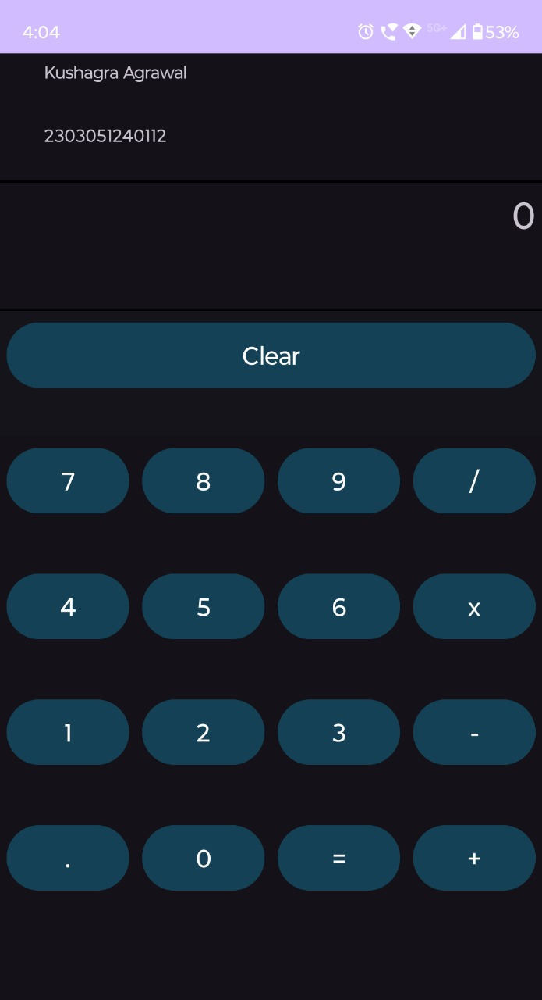

# Calculator Application

A simple yet powerful calculator application for Android that performs basic arithmetic operations such as addition, subtraction, multiplication, and division. The app features a clean, responsive, and user-friendly interface, making it easy to use on various screen sizes.

---

## Table of Contents

1. [Introduction](#introduction)  
2. [Features](#features)  
3. [Screenshots and Demo](#screenshots-and-demo)  
4. [Project Structure](#project-structure)  
5. [Installation and Setup](#installation-and-setup)  
6. [Usage](#usage)  
7. [Technologies Used](#technologies-used)  
8. [Contributing](#contributing)  
9. [License](#license)  
10. [Developer](#developer)

---

## Introduction

The **Calculator Application** is designed to provide users with basic arithmetic operations in a visually appealing and intuitive interface. This project is suitable for learning Android development and building small utility apps with responsive UI and interactive functionality.

---

## Features

- **Basic Arithmetic Operations**:  
  Perform addition, subtraction, multiplication, and division seamlessly.
  
- **Clear Button**:  
  Reset the calculator to its default state with a single tap.
  
- **Responsive Design**:  
  The layout adapts to various screen sizes, providing a consistent user experience across devices.

- **Real-Time Calculation**:  
  Results are dynamically updated as the user inputs numbers and operations.

---

## Screenshots and Demo

### Screenshot
Below is a screenshot of the Calculator Application in action:

  
(*Replace `images/calculator_screenshot.png` with the path to your screenshot file in the repository.*)

### Demo Video
Watch the demo video showcasing the Calculator App:  
[![Watch the demo][(https://img.youtube.com/vi/VIDEO_ID/0.jpg)](https://www.youtube.com/watch?v=VIDEO_ID)](https://drive.google.com/file/d/1NcxXxFB3e0SraUFxdNu5_u7jOHY1wCif/view?usp=sharing)  
(*Replace `VIDEO_ID` with the actual YouTube video ID or provide a file link to the demo.*)

---

## Project Structure

```
Calculator-App/
│
├── app/src/main/
│   ├── res/layout/activity_main.xml        # XML layout file for the UI
│   ├── java/com/example/calculatorapp/     # Package containing Java code
│   │   └── MainActivity.java               # Main logic of the calculator
│
├── images/                                 # Folder containing screenshots
│   └── calculator_screenshot.png           # Screenshot of the Calculator App
│
├── README.md                               # Project documentation
└── LICENSE                                 # License file (optional)
```

---

## Installation and Setup

Follow these steps to set up and run the Calculator Application locally on your Android device or emulator:

1. **Clone the Repository**:
   ```bash
   git clone https://github.com/Agrawalers/Calculator-App.git
   cd Calculator-App
   ```

2. **Open in Android Studio**:
   - Launch Android Studio.
   - Open the project folder.

3. **Build and Run the App**:
   - Connect your Android device via USB or start an emulator.
   - Click the **Run** button in Android Studio to install and launch the app on your device.

---

## Usage

1. **Launch the App**:  
   Open the Calculator App on your Android device.

2. **Enter Numbers**:  
   Use the numeric buttons to input numbers.

3. **Perform Operations**:  
   Tap on the arithmetic buttons (`+`, `-`, `×`, `/`) to perform calculations.

4. **Get Results**:  
   Press the `=` button to display the result.

5. **Clear Input**:  
   Use the **Clear** button to reset the calculator.

---

## Technologies Used

- **Java**: Core logic and event handling for arithmetic operations.  
- **XML**: Design and layout of the user interface.  
- **Android SDK**: Development framework for building the Android application.

---

## Contributing

Contributions are welcome! If you have ideas to enhance the app or want to report a bug, feel free to fork the repository and submit a pull request.

### Steps to Contribute:

1. Fork the repository.  
2. Create a new branch (`git checkout -b feature-branch`).  
3. Commit your changes (`git commit -m 'Add new feature'`).  
4. Push to the branch (`git push origin feature-branch`).  
5. Open a pull request.

---

## License

This project is licensed under the MIT License. You are free to use, modify, and distribute the code as long as the license file is included in the project.

---

## Developer

**Kushagra Agrawal**  
- GitHub: [Agrawalers](https://github.com/Agrawalers)  


---
